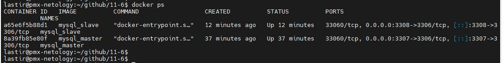
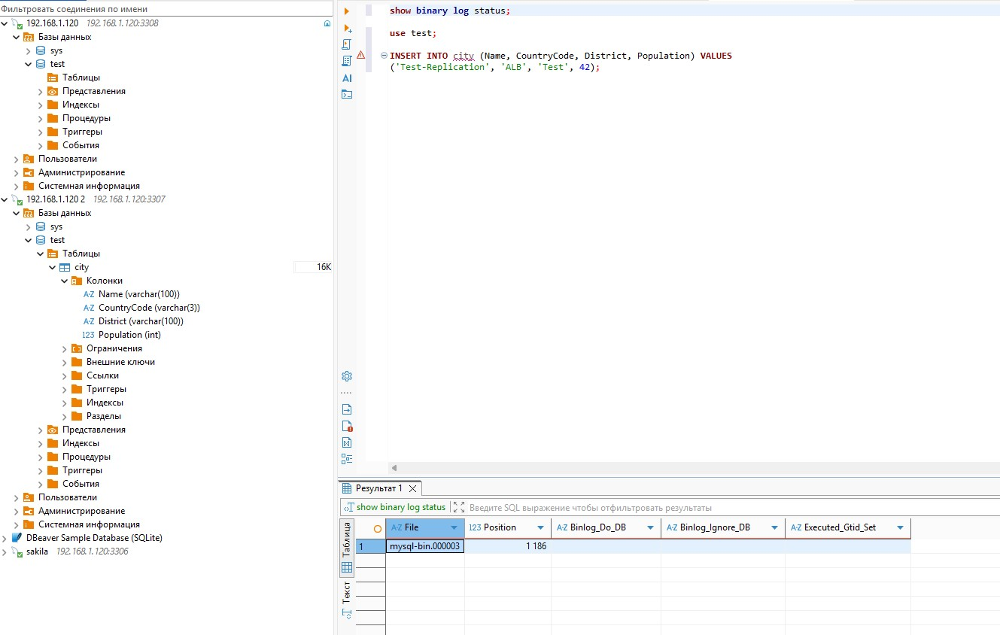
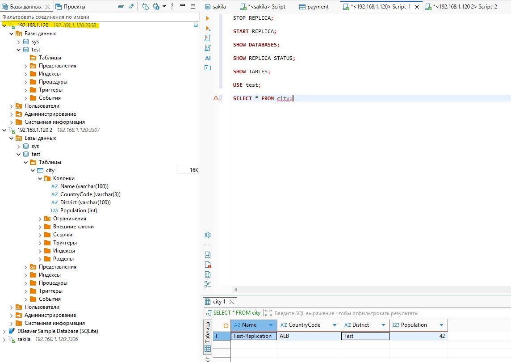
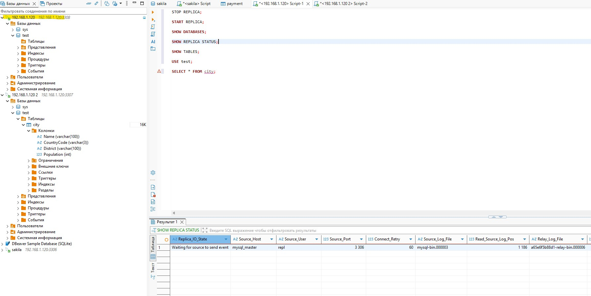

# Домашнее задание к занятию «Репликация и масштабирование. Часть 1» - Минин Александр

### Задание 1

На лекции рассматривались режимы репликации master-slave, master-master, опишите их различия.

*Ответить в свободной форме.*
### Решение 1
master-slave:
- репликация в одну сторону от мастера к слэйву
- запись в БД только на мастере, чтение в основном на слэйве
- чаще используется асинхронная репликация
- одна точка отказа, низкая отказоустойчивость
- высокая согласованность данных

master-master:
- репликация в обе стороны
- запись в БД и чтение на обоих СУБД
- чаще используется синхронная репликация
- высокая отказоустойчивость
- сложная согласованность данных, требует разрешение конфликтов
---

### Задание 2

Выполните конфигурацию master-slave репликации, примером можно пользоваться из лекции.

*Приложите скриншоты конфигурации, выполнения работы: состояния и режимы работы серверов.*
### Решение 2
master:
Dockerfile_master
```
FROM mysql:9.3
# Копируем файлы конфигурации
COPY ./master.cnf /etc/mysql/conf.d/my.cnf
COPY ./master.sql /docker-entrypoint-initdb.d/start.sql
# Переменные окружения для настройки репликации
ENV MYSQL_ROOT_PASSWORD=12345
# Запускаем сервисы
CMD ["mysqld"]
```
master.cnf
```
[mysqld]
server-id=1
log-bin = mysql-bin
binlog_format=ROW
```
master.sql
```
CREATE USER 'repl'@'%' IDENTIFIED BY 'slavepass';
GRANT REPLICATION SLAVE ON *.* TO 'repl'@'%';
FLUSH PRIVILEGES;
```
replica:
Dockerfile_slave
```
FROM mysql:9.3
# Копируем файлы конфигурации
COPY ./slave.cnf /etc/mysql/conf.d/my.cnf
COPY ./slave.sql /docker-entrypoint-initdb.d/start.sql
# Переменные окружения для настройки репликации
ENV MYSQL_ROOT_PASSWORD=12345
# Запускаем сервисы
CMD ["mysqld"]
```
slave.cnf
```
[mysqld]
server-id=2
read_only = 1
```
slave.sql
```
CHANGE REPLICATION SOURCE TO
SOURCE_HOST='mysql_master',
SOURCE_USER='repl',
SOURCE_PASSWORD='slavepass',
SOURCE_SSL=1;
START REPLICA;
```
сборка и запуск контейнеров:
```
docker build -t mysql_master -f ./Dockerfile_master .
docker build -t mysql_slave -f ./Dockerfile_slave .
docker run -d --name mysql_master --net replication -p 3307:3306 mysql_master
docker run -d --name mysql_slave --net replication -p 3308:3306 mysql_slave
```









---

## Дополнительные задания (со звёздочкой*)
Эти задания дополнительные, то есть не обязательные к выполнению, и никак не повлияют на получение вами зачёта по этому домашнему заданию. Вы можете их выполнить, если хотите глубже шире разобраться в материале.

---

### Задание 3* 

Выполните конфигурацию master-master репликации. Произведите проверку.

*Приложите скриншоты конфигурации, выполнения работы: состояния и режимы работы серверов.*
